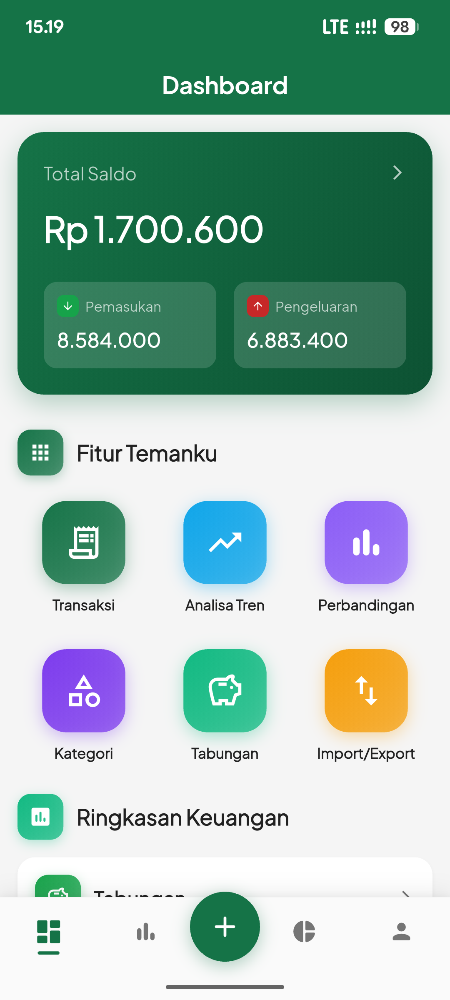
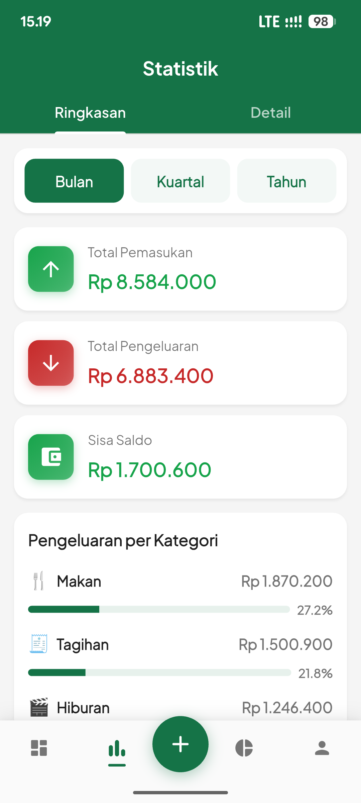
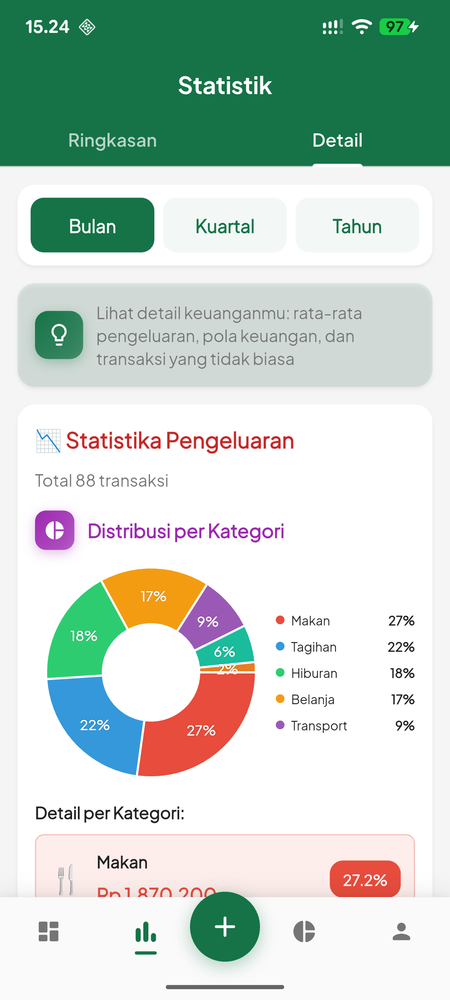
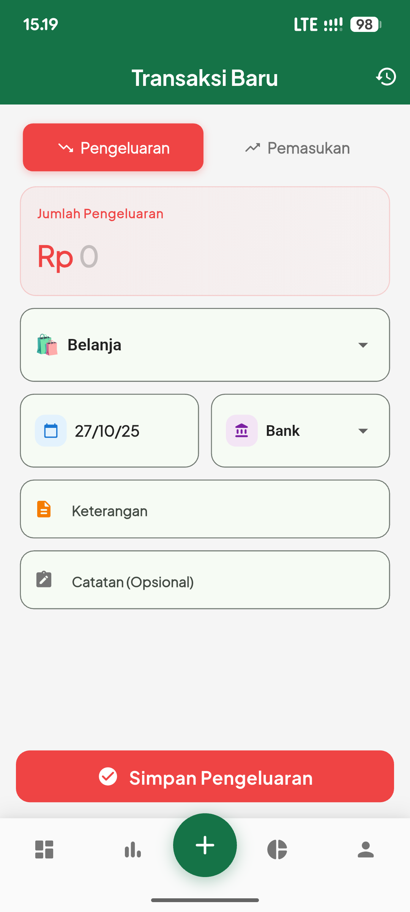
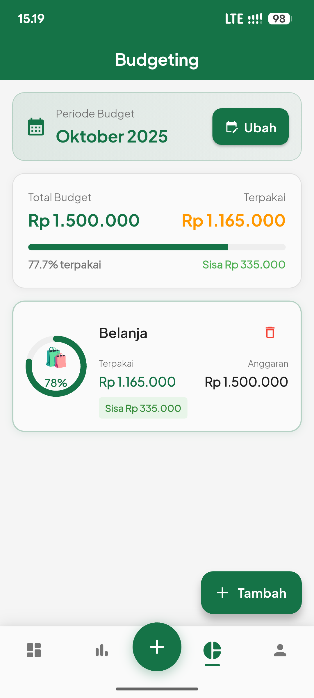
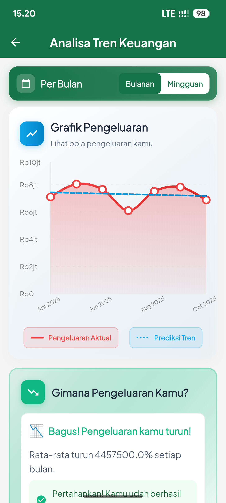
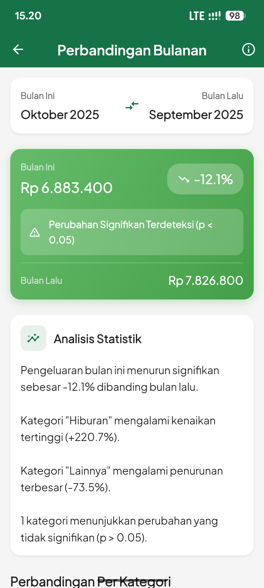
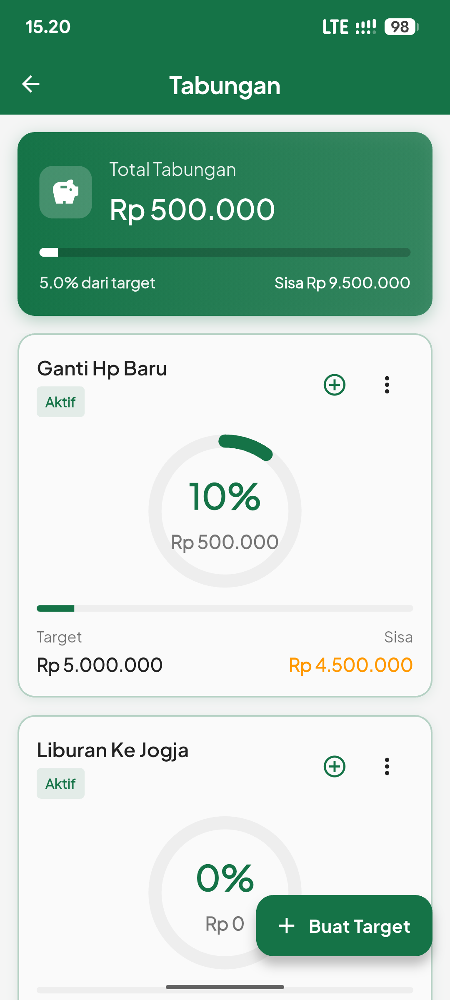

# TemanKu Mobile 📱

Teman kecil yang bantu jagain keuanganmu

## Deskripsi

TemanKu adalah aplikasi manajemen keuangan pribadi yang membantu Anda melacak pengeluaran, pemasukan, dan mengelola budget dengan mudah dan intuitif. Dilengkapi dengan AI-powered voice input dan analisis statistik yang mendalam.

## Fitur

- 📊 **Dashboard Interaktif** - Visualisasi keuangan dengan grafik dan chart
- 💰 **Transaksi** - Catat pemasukan dan pengeluaran dengan mudah
- 🏷️ **Kategori** - Kelola kategori transaksi sesuai kebutuhan
- 🏦 **Akun** - Kelola berbagai akun seperti cash, bank, e-wallet
- 💳 **Transfer Antar Akun** - Transfer dana antar akun dengan mudah
- 🎯 **Budget** - Atur budget per kategori dengan monitoring real-time
- 💎 **Tabungan** - Catat dan monitor target tabungan
- 📈 **Riwayat** - Lihat riwayat transaksi lengkap dengan filter
- 📊 **Statistik** - Analisa keuangan dengan berbagai chart dan insight
- 📈 **Trend Analysis** - Analisa tren keuangan dengan prediksi AI
  - Grafik line chart dengan trend prediction
  - Mode bulanan dan mingguan
  - Correlation analysis income vs expense
  - Statistical insights (mean, std dev, etc)
- 🔄 **Monthly Comparison** - Bandingkan pengeluaran 2 bulan dengan uji hipotesis statistik
- 📤 **Import/Export** - Import dan export data dalam format CSV
- 🔐 **Autentikasi** - Login dengan email/password atau Google Sign-In via Supabase
- 🔄 **Reset Data** - Hapus semua data dengan verifikasi 2 langkah
- 🎙️ **Voice to Transaction** - Tambah transaksi dengan bicara menggunakan AI
  - Speech-to-text dengan dukungan bahasa Indonesia
  - AI parsing untuk mengenali jumlah, kategori, dan deskripsi
  - Multi-transaction support (bisa mencatat beberapa transaksi sekaligus)
  - Preview dan edit sebelum menyimpan
- 🏠 **Android Widget** - Homescreen widget 3x1 untuk akses cepat
  - Tekan ikon mic untuk langsung ke halaman voice transaction
  - Works dengan cold start dan warm start
- 🎨 **Welcome Onboarding** - Editorial onboarding untuk pengguna baru
  - Magazine-style design dengan editorial layout
  - Progressive disclosure untuk fitur-fitur utama

## Getting Started

### Prerequisites

- Flutter SDK (3.9.2 atau lebih tinggi)
- Dart SDK (3.9.2 atau lebih tinggi)
- Android Studio / VS Code
- Android SDK (untuk build Android)
- Xcode (untuk build iOS - Mac only)

### Installation

1. Clone repository ini:

```bash
git clone https://github.com/diopratama99/temanku.git
```

2. Install dependencies:

```bash
flutter pub get
```

3. Generate launcher icons:

```bash
dart run flutter_launcher_icons
```

4. Generate splash screen:

```bash
dart run flutter_native_splash:create
```

5. Run aplikasi:

```bash
flutter run
```

## Build

### Android APK

```bash
flutter build apk --release
```

### Android App Bundle

```bash
flutter build appbundle --release
```

### iOS

```bash
flutter build ios --release
```

## Tech Stack

- **Framework**: Flutter 3.9.2+
- **State Management**: Provider
- **Database**: Supabase 
- **Charts**: fl_chart
- **Statistical Analysis**: Custom implementation (Linear Regression, Hypothesis Testing)
- **Authentication**: Supabase Auth
- **Voice Processing**: speech_to_text, permission_handler
- **AI/NLP**: Supabase Edge Functions (Deno + OpenAI) untuk parsing transaksi
- **File Handling**: file_picker, share_plus, path_provider
- **Image Handling**: image_picker
- **Icons**: flutter_launcher_icons
- **Splash Screen**: flutter_native_splash
- **Fonts**: Google Fonts
- **Number Formatting**: intl (Indonesian locale)

## Screenshots

<p align="center">
  
  
  
  
</p>

<p align="center">
  
  
  
  
</p>

## 🗂️ Struktur Project

```
lib/
├── main.dart                 # Entry point aplikasi
├── data/
│   └── app_database.dart    # Database helper & models
├── pages/
│   ├── home_page.dart       # Home with bottom navigation
│   ├── dashboard_page.dart  # Dashboard overview
│   ├── login_page.dart      # Login & Register
│   ├── welcome_page.dart    # Onboarding flow untuk pengguna baru
│   ├── add_transaction_page.dart  # Add transaction form
│   ├── voice_add_transaction_page.dart # Voice-to-transaction dengan AI
│   ├── transactions_page.dart     # Transaction history
│   ├── categories_page.dart       # Category management
│   ├── account_transfers_page.dart # Account transfers
│   ├── budgets_page.dart          # Budget planning
│   ├── savings_page.dart          # Savings goals
│   ├── statistics_page.dart       # Charts & analytics
│   ├── trend_analysis_page.dart   # Trend analysis with AI prediction
│   ├── monthly_comparison_page.dart # Monthly expense comparison
│   ├── profile_page.dart          # User profile
│   └── import_export_page.dart    # Import/Export data
├── services/
│   ├── auth_service.dart    # Authentication service (Supabase)
│   ├── voice_transaction_service.dart # Voice parsing & AI service
│   └── launch_action_service.dart # Widget intent handler
├── state/
│   ├── auth_notifier.dart   # Authentication state
│   └── theme_notifier.dart  # Theme (light/dark) state
├── theme/
│   └── app_theme.dart       # Theme configuration
├── utils/
│   ├── snackbar_utils.dart  # Snackbar helpers
│   ├── trend_analysis.dart  # Statistical analysis utilities
│   └── app_localizations.dart # Localization strings
└── widgets/
    ├── app_bottom_navigation.dart
    ├── balance_card.dart
    ├── editorial.dart       # Editorial magazine-style widgets
    ├── form_fields.dart
    ├── main_navigation_scaffold.dart
    ├── state_widgets.dart
    └── transaction_list_item.dart

android/app/src/main/
├── AndroidManifest.xml              # Widget receiver registration
├── kotlin/com/temanlabs/temanku/
│   ├── MainActivity.kt             # MethodChannel for widget intents
│   └── TemanKuVoiceWidgetProvider.kt # AppWidgetProvider implementation
└── res/
    ├── layout/temanku_voice_widget.xml    # Widget UI layout
    ├── xml/temanku_voice_widget_info.xml  # Widget metadata
    └── drawable/temanku_voice_widget_background.xml # Widget styling
```

## Configuration

### Google Sign-In

Untuk menggunakan fitur Google Sign-In, Anda perlu:

1. Setup project di [Google Cloud Console](https://console.cloud.google.com/)
2. Enable Google Sign-In API
3. Konfigurasi OAuth 2.0 credentials
4. Update `android/app/google-services.json` (Android)
5. Update `ios/Runner/GoogleService-Info.plist` (iOS)

### Database

Aplikasi menggunakan SQLite untuk penyimpanan lokal dan Supabase untuk authentication serta cloud functions. Database akan otomatis dibuat saat pertama kali aplikasi dijalankan.

### Supabase Setup

1. Buat project di [Supabase Dashboard](https://supabase.com/)
2. Enable Email/Password dan Google OAuth providers
3. Deploy Edge Function untuk parsing transaksi:
   ```bash
   supabase functions deploy parse-transaction
   ```
4. Tambahkan OpenAI API key ke Supabase secrets:
   ```bash
   supabase secrets set OPENAI_API_KEY=your_key_here
   ```
5. Copy `supabase.json` untuk konfigurasi lokal:
   ```json
   {
     "SUPABASE_URL": "https://your-project.supabase.co",
     "SUPABASE_ANON_KEY": "your-anon-key"
   }
   ```

### Android Widget

Widget 3x1 otomatis tersedia setelah instalasi. Untuk menambahkan ke homescreen:
1. Long press di area kosong homescreen
2. Pilih "Widgets"
3. Cari "TemanKu"
4. Drag widget 3x1 ke homescreen

## Development

### Run in Debug Mode

```bash
flutter run --dart-define-from-file=supabase.json
```

### Run Tests

```bash
flutter test
```

### Analyze Code

```bash
flutter analyze
```

### Format Code

```bash
flutter format .
```

## License

Copyright © 2026 Teman Labs. All rights reserved.

## Author

**Dio Pratama - Teman Labs**

- GitHub: [@diopratama99](https://github.com/diopratama99)

## Contributing

Contributions, issues and feature requests are welcome!

## Show your support

Give a ⭐️ if this project helped you!

---


